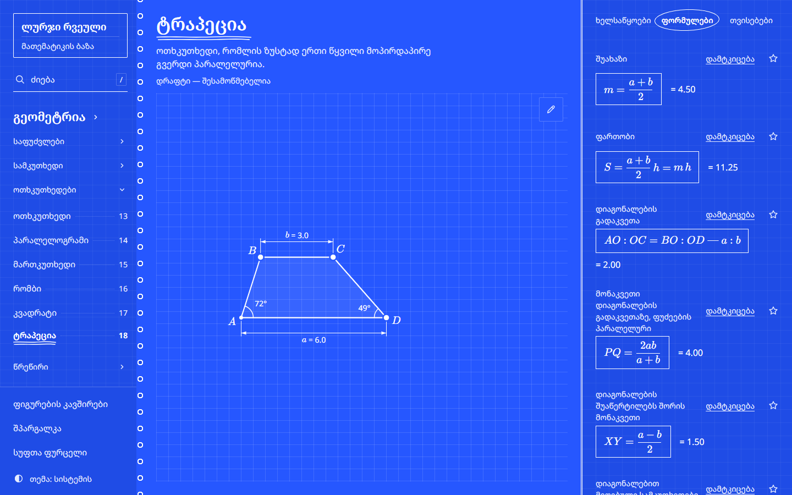
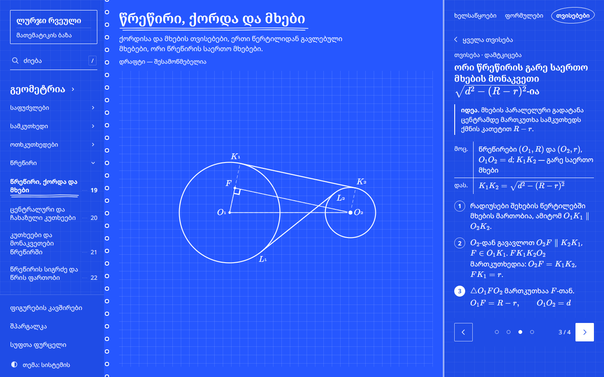
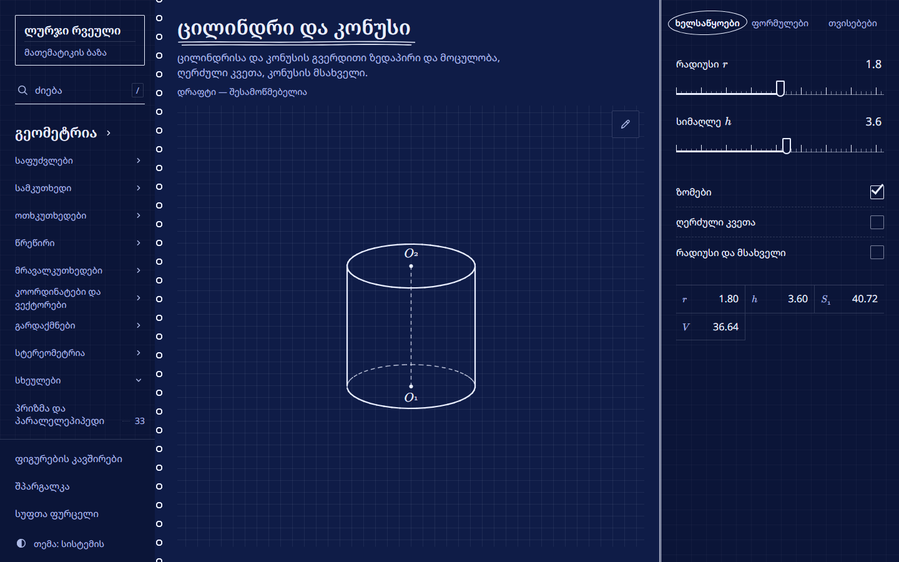
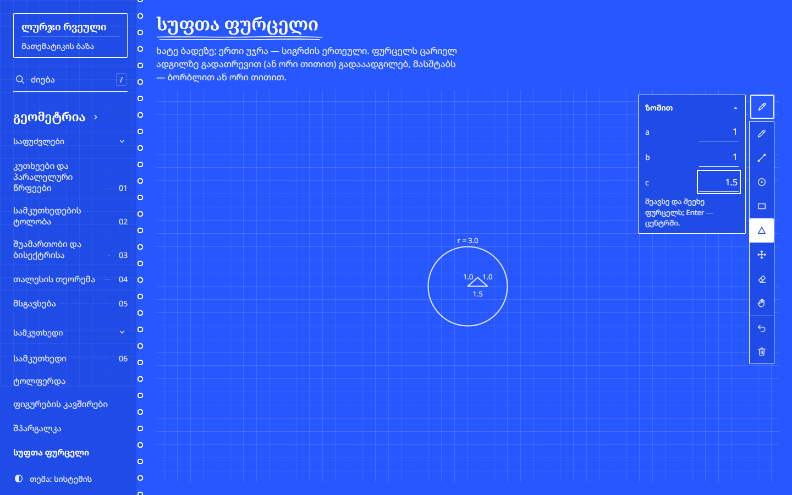
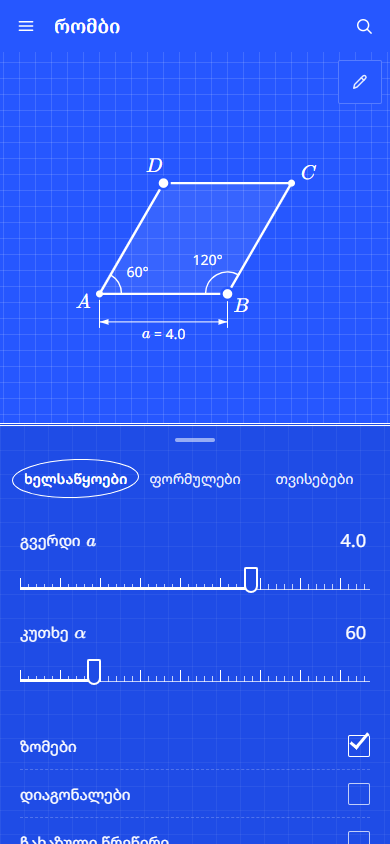

# ლურჯი რვეული

**Blue Notebook** — a geometry notebook for the Georgian national exam, written in Georgian, with every page also in English, where every figure moves.

Each topic is one page of a blue school notebook: an interactive figure on the left, and on the right the formulas, the properties and their step-by-step proofs. Drag a vertex and every measurement, readout and formula value follows. Open a proof and the figure plays it, one step at a time.



---

## What is inside

The syllabus follows S. Topuria's geometry textbook, planimetry and stereometry.

| Section | Topics |
| --- | --- |
| Foundations | angles and parallel lines, congruence, perpendicular bisector and angle bisector, Thales' theorem, similarity |
| Triangles | the triangle, isosceles, right triangle, sine and cosine in a right triangle, remarkable points (medians, bisectors, altitudes, Stewart's theorem), area, the laws of sines and cosines |
| Quadrilaterals | the quadrilateral (cyclic, tangential, Ptolemy), parallelogram, rectangle, rhombus, square, trapezoid |
| Circle | chords and tangents, inscribed and central angles, angles and segments in a circle, circumference and area |
| Polygons | angle sums and diagonals, regular polygons |
| Coordinates and vectors | distance, midpoint, equations of a line and a circle, vector operations, dot product |
| Transformations | symmetries, rotation, translation, homothety |
| Stereometry | lines and planes in space, perpendicularity and the three perpendiculars theorem, dihedral angles, coordinates in space |
| Solids | prism and parallelepiped, pyramid, cylinder and cone, ball and sphere |

In numbers: 38 topics, 223 properties with proofs, 180 formula cards, 176 problems, 49 interactive figures, and a glossary of 102 school terms.

Every topic also has problems, modelled on the problem types of Topuria's collection but written fresh. The figure takes each problem's shape and shows its data; you type the answer and the page checks it, telling you what probably went wrong (rounded too early, the adjacent angle, a diameter instead of a radius). Help comes in stages: a hint, then the solution's first step, then the whole solution, which plays on the figure like a proof.

The site also has:
- practice: random problems from the chapters you choose, with an optional time limit and a score at the end; the home page shows how many of each chapter's problems you have solved;
- a topic map that shows what each topic builds on, and a glossary of the school terms in Georgian and English;
- a cheat sheet with every formula on one page;
- a page on how the quadrilaterals are related, which can also work out what a shape is from the facts you know;
- a blank sheet of squared paper for your own drawings;
- an English version of every page, topics and problems included, at `/en/` (the globe link in the menu switches language).

---

## Proofs that play on the figure

Every property has a proof written for a school student. Each step highlights what it talks about: a segment, an angle, a pair of congruent triangles, an arc. The left and right arrow keys walk through the steps. While a proof is open you can still drag the figure, because the proof holds for every shape, not just the one drawn.



---

## Solids you can turn

Stereometry figures are real 3D models drawn the way textbooks draw them:
- hidden edges are dashed;
- the back halves of circles are dashed too;
- cylinders and cones get their outline lines.

Drag the paper and the solid turns. One button brings it back to the starting view.



---

## Draw on the grid

Every figure has a pencil, so you can sketch on top of the drawing:
- freehand lines, segments, circles, rectangles and triangles;
- move and erase what you drew, and undo.

Shapes snap to the squares of the grid. They can also be drawn from exact sizes: a segment by its length, a circle by its radius, a triangle by its three sides. Impossible triangles are refused with the reason.

The blank sheet is the same pencil on empty notebook paper, where one square is one unit.



---

## Made for a phone too

On a phone the figure stays at the top and the formulas and properties move into a sheet below it. The page itself never scrolls; only the panels do.

Search with Georgian word endings is opened with `/` or Ctrl+K. Formulas you pin with the star button appear in search before you type anything. There is a light and a night theme, and a one-page print layout for every topic.

<p align="center"></p>

---

## Correct by construction

A reference site for an exam is only useful if it is right. Two layers keep it that way.

**Every claim is checked numerically.** Each property on a figure page has a matching check in its figure's file. The test suite runs every check on 500 random shapes.
- Criteria are checked by building the shape from the hypothesis alone.
- Areas and volumes are measured independently of their formulas: by fine polygons, by tetrahedra, or by summing slices.

**Every page is linted.** `pnpm check` validates the frontmatter. It also checks that:
- every proof step only mentions points that exist on its figure;
- every link and prerequisite resolves;
- every term defined in bold is in the glossary;
- no wrong variant of a term (for example „საშუალო ხაზი“ instead of „შუახაზი“) appears.

Pages stay marked as drafts until a person has read their Georgian and their proofs.

---

## Running it

```bash
pnpm install
pnpm dev          # http://localhost:4321
pnpm build        # the static site in dist/, with the search index
pnpm preview      # serve the build
```

Search only works after a build.

### Checks

```bash
pnpm check        # content: frontmatter, links, glossary, proofs against their figures
pnpm test         # geometry engine and every figure's checks on random shapes
pnpm typecheck
pnpm e2e          # Playwright on the production build: layout at four sizes and two themes, proofs, search, drawing, English pages
```

### Adding a topic

```bash
pnpm new topic geometry/my-topic triangles
```

This creates a draft page with every building block. Its English copy comes from `pnpm translate extract my-topic`, translated in order and written back with `pnpm translate apply`, so both files keep the same structure. After a build, `pnpm og` makes the link-preview images for new topics. [docs/guide-ka.md](docs/guide-ka.md) is the day-to-day guide in Georgian, and [CLAUDE.md](CLAUDE.md) holds the repository's conventions. A new subject is one entry in `src/subjects.ts`; the first algebra topic was added this way, with no code changes.

---

## How it is built

- **Astro** generates a static site from **MDX** pages. Each topic file is rendered twice, once as formulas and once as properties, so it never imports anything.
- **KaTeX** renders all mathematics at build time.
- **Pagefind** builds the search index; a small stemmer handles Georgian word endings.
- **A custom SVG geometry engine**, written for this site instead of using JSXGraph (about 259 KB):
  - a figure maps its sliders to named points, so constraints hold by construction;
  - dragging a vertex inverts that mapping numerically;
  - text and marks are drawn at a fixed size whatever the zoom, and labels move out of each other's way;
  - solids are projected from 3D on every frame.
- **Vitest** runs the checks and **Playwright** the browser tests.
- Fonts are self-hosted (Noto Sans and Noto Serif Georgian), and there is no tracking.

```
src/
  content/topics/   one MDX file per topic, glossary.json
  content/topics-en/ the English translation of each topic, block for block
  i18n/             English for the interface and the figures
  views/            page bodies shared by the Georgian and English routes
  figures/          one file per figure; engine/ is the renderer, solver and 3D projection
  components/       page parts: panel, figure, proof blocks
  scripts/          proof stepper, search, theme
  pages/            routes: Georgian at the root, English under en/
tests/e2e/          browser tests
```

---

## Deploying

The site is fully static.

1. Import the repository into Vercel. `vercel.json` already sets the build command (`pnpm build`) and the output folder (`dist`).
2. Vercel picks the pnpm version from `packageManager` in `package.json`.
3. Set `site` in `astro.config.mjs` to the final address.
